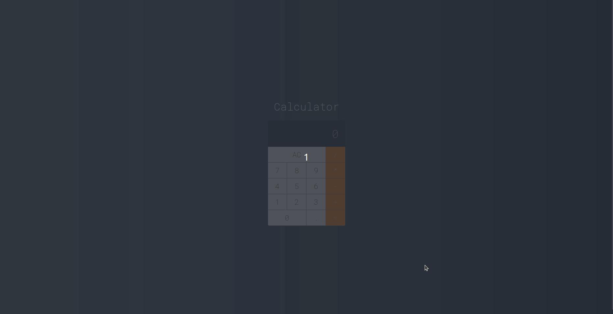

<h1 align="center"><strong></strong></h1>
<h1 align="center"><strong>Calculator</strong></h1>
<br>
<p align="center">
  <a href="#-project">Project</a>&nbsp;&nbsp;&nbsp;|&nbsp;&nbsp;&nbsp;
  <a href="#installation">Installation</a>&nbsp;&nbsp;&nbsp;|&nbsp;&nbsp;&nbsp;
  <a href="#-technologies">Technologies</a>
  &nbsp;&nbsp;&nbsp;|&nbsp;&nbsp;&nbsp;
  <a href="#-deploy">Deploy</a>
</p>

<br>


### This is a project that i practice my knowledge of ReactJS.

<br>

## 💻 Project


<p>This application shows a calculator similar to the iphone built in ReactJS.</p>

<br>

<br>
<br>

## 🚀 Deploy
 -  https://react-calculator.canale.dev

 - This application was deployed with Github Pages library 


 ```bash
 
# Running deploy
$ npm run deploy
```
<br>

## Installation

- Important: You must have installed the React.js and Git

```bash
# clone it
$ git clone git@github.com:airton-canale/react-calculator.git

$ cd react-calculator

# Install dependencies
$ npm install

# Running scripts
$ npm start
```
- And enter in your browser using http://localhost:3000


## 🚀 Technologies

This project was developed using the following technologies:

-  **React.JS**
-  **Javascript**
-  **CSS**
